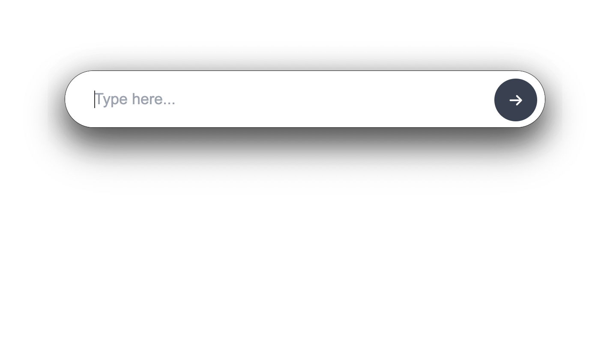
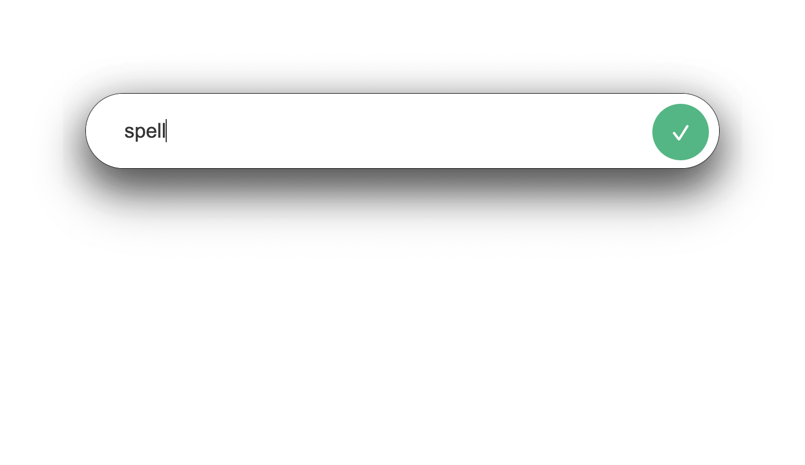
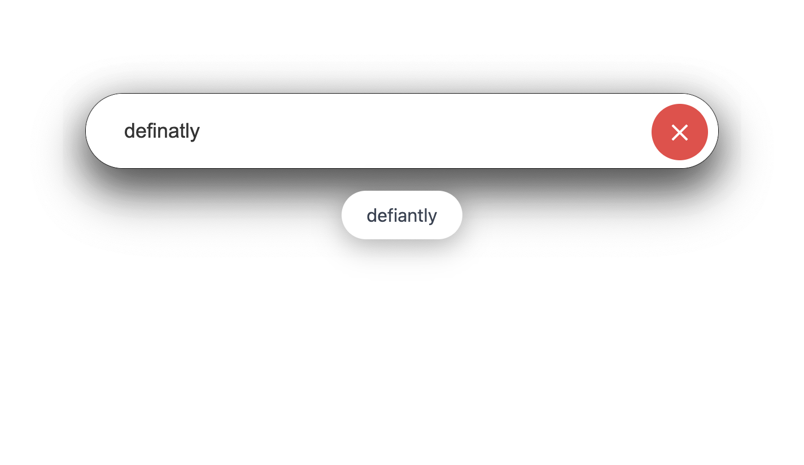
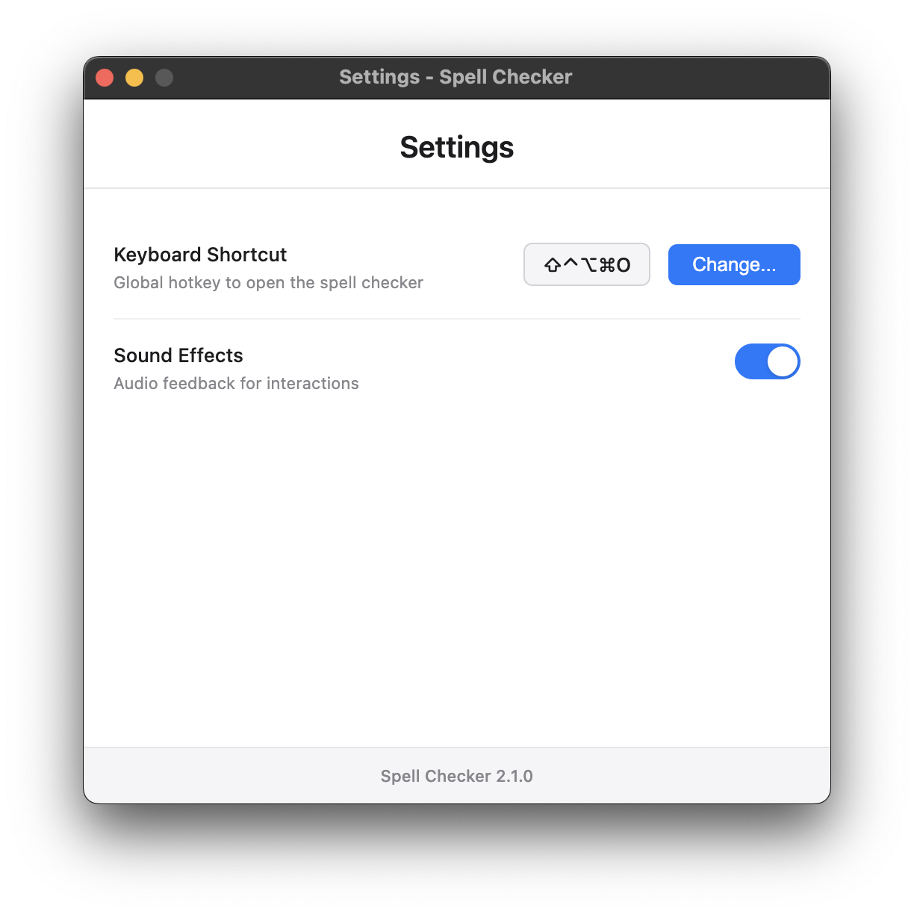

# Spellcheck
Spellcheck is an Electron app for macOS to help user who struggle with spelling to quickly correct words using hotkeys.

## Why Spellcheck
I'm inspired by [Raycast's](https://www.raycast.com/) keyboard based workflows, but I wanted a product that worked in a more specific way and used a more specific UI than what Raycast offered.

## Features
- Open the checker with a hotkey (⌘ + ⇧ + O by default)
- Type a word and press enter to check it
- Get instant suggestions if a word is wrong
- Quickly a correct spelling to the clipboard
- Appears over other apps and can return focus back
- Menu bar icon
- Settings menu
- Stylish floating UI
- Bad input rejection (disallows invalid input and shakes to indicate an invalid input has been entered)
- Standard keyboard shortcuts are disabled so the user doesn't accidentally open dev tools, minimize the UI, etc.

## Gallery
### Word Entry
The bar auto-focuses the text field and appears over other windows (even fullscreen ones) to make it easy to check a word's spelling quickly. The UI can be quickly closed by pressing ESC.


### Correctly Spelled Word
When a user correctly spells a word, it shows a green checkmark.


### Incorrectly Spelled Word
When the user incorrectly spells a word, they see this red "x" along with suggestions that can be picked using they mouse or left/right arrow keys. Selecting an option copies it to the clipboard and closes the UI for seamless writing.


### Settings UI
The settings menu exposes helpful parameters so the user can tweak the app how they would like. Unlike the main UI, it is a standard macOS window which can be dragged.


## Installation
This app is currently under development. Currently the only way to run it is to build it from source. In the future, pre-built binaries may be provided under "Releases". *Please note this app is currently only available for macOS.*

### Building from Source
1. Clone the repository
```bash
git clone https://github.com/geckoHex/macOS-hotkey-spellcheck.git
cd macOS-hotkey-spellcheck
```
2. Install dependencies
```bash
npm i
```
3. Build the app
```bash
npm run build
```

4. Use Finder to open the `dist/` directory, double-click the disk image, and drag the app to your Applications folder.

### First Run
Because this app is not signed, macOS will prevent it from being opened the first time. When you first try to open it, macOS will block the app from running. To fix this, follow these steps:
1. Close the warning popup (do not click "Move to Trash")
2. Open System Settings
3. Navigate to "Privacy & Security"
4. Scroll to the bottom
5. Click "Allow Anyway" next to the message about the blocked app

Please also note that the first time you install the app as while as after subsequent updates the app may take some time to launch as macOS performs its own checks. This is normal behavior. Quitting and relaunching in day-to-day use should not encounter this slowdown.

When you first launch the app, you may want to adjust the settings to your preference. You can access the settings menu from the menu bar icon. If you'd like, you can rearrange the menu bar icon's position by command and dragging the icon.